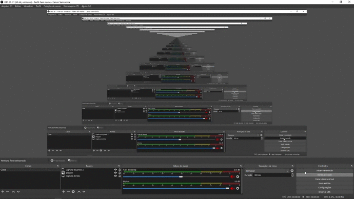

# 🗂️ Topics

- <a href="#About"> About</a>
- <a href="#Features"> Features</a>
- <a href="#How-to-use"> How to use</a>
  - <a href="#Prerequisites"> Prerequisites</a>
  - <a href="#Running-the-app"> How to use this code</a>
- <a href="#License"> License</a>

<h1 id="About">🌱About</h1>

Use the code from this repository as a basis for making snippets in the Vs Code.

# 📌 Features

- [x] I created snippets you need in Vs Code

<h1 id="How-to-use">🤓How to use</h1>

<h3 id="Prerequisites">Prerequisites:</h3>

To put this project into practice you will need the following tool:

<a href="https://code.visualstudio.com">Visual Studio Code</a>

<h3>How to use this code:</h3>

<h1 id="License">📜License</h1>

